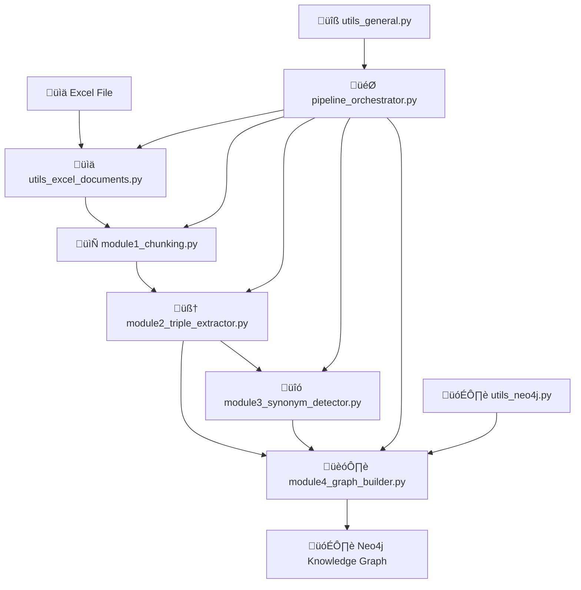

# Prompt 


```bash
file pipeline.py sẽ để phần test nhỏ ở main rồi nhỉ 
Thế sẽ cần 1 file run_... gì đó nữa: file này sẽ đọc file excel từ .xslx ở cùng thư mục offline luôn 

(file gồm 3 cột: doc_id	title	text  ) 

example: 
doc_id PH_0	
title PH	
text Các dung dịch nước có giá trị pH nhỏ hơn 7 được coi là có tính axít , trong khi các giá trị pH lớn hơn 7 được coi là có tính kiềm .

====
Yourr task: 
1. Hướng dẫn chi tiết cách dựng Neo4DB đã 
2. Coding các phần 

src/offline/
├── module1_document_processor.py    # (Simple - keep paragraphs)
├── module2_triple_extractor.py      # OpenIE với Qwen
├── module3_synonym_detector.py      # Embedding similarity
├── module4_graph_builder.py         # Connect nodes
└── pipeline_orchestrator.py        # Coordinate all modules
xlsx.py

Dùng pathlib cho tất cả đồng bộ 


```


3 lượt trả lời của genspark mới đủ: https://www.genspark.ai/agents?id=4863ccd8-922b-491d-87e6-acf489c606a8

# üöÄ **GraphRAG Neo4j Implementation Guide**

## 🗃️ **1. Setup Neo4j Database**

### **📦 Docker Setup (Recommended)**

```bash
# 1. T·∫°o docker-compose.yml
mkdir -p graphrag-thesis/docker
cd graphrag-thesis
```

**docker-compose.yml:**
```yaml
version: '3.8'
services:
  neo4j:
    image: neo4j:5.13-community
    container_name: graphrag-neo4j
    ports:
      - "7474:7474"  # Neo4j Browser
      - "7687:7687"  # Bolt protocol
    environment:
      - NEO4J_AUTH=neo4j/graphrag123
      - NEO4J_PLUGINS=["apoc", "graph-data-science"]
      - NEO4J_dbms_security_procedures_unrestricted=apoc.*,gds.*
      - NEO4J_dbms_memory_heap_initial__size=1G
      - NEO4J_dbms_memory_heap_max__size=2G
    volumes:
      - ./neo4j_data:/data
      - ./neo4j_logs:/logs
      - ./neo4j_import:/var/lib/neo4j/import
    restart: unless-stopped

networks:
  default:
    name: graphrag-network
```

**Start Database:**
```bash
# Start Neo4j
docker-compose up -d

# Check logs
docker-compose logs -f neo4j

# Access Neo4j Browser: http://localhost:7474
# Username: neo4j
# Password: graphrag123
```

---

## 📁 **2. Project Structure Setup**

```bash
# Create project structure
mkdir -p graphrag-thesis/src/offline
mkdir -p graphrag-thesis/data
mkdir -p graphrag-thesis/tests
touch graphrag-thesis/requirements.txt
```

**requirements.txt:**
```txt
neo4j>=5.13.0
pandas>=2.0.0
openpyxl>=3.1.0
sentence-transformers>=2.2.0
huggingface-hub>=0.17.0
numpy>=1.24.0
python-dotenv>=1.0.0
pathlib>=1.0.0
pytest>=7.4.0
```

---

## 🛠️ **3. Core Implementation**

### **📄 src/offline/module1_document_processor.py**

```python
"""
Module 1: Document Processor
Xử lý documents từ Excel, giữ nguyên paragraphs
"""

from pathlib import Path
from typing import List, Dict, Any
import pandas as pd
import logging

logger = logging.getLogger(__name__)

class DocumentProcessor:
    """Xử lý documents từ Excel file"""
    
    def __init__(self):
        self.processed_docs = []
        
    def load_excel(self, file_path: Path) -> pd.DataFrame:
        """Load Excel file và validate structure"""
        try:
            df = pd.read_excel(file_path)
            
            # Validate required columns
            required_cols = ['doc_id', 'title', 'text']
            missing_cols = [col for col in required_cols if col not in df.columns]
            
            if missing_cols:
                raise ValueError(f"Missing required columns: {missing_cols}")
            
            # Remove empty rows
            df = df.dropna(subset=['doc_id', 'text'])
            
            logger.info(f"Loaded {len(df)} documents from {file_path}")
            return df
            
        except Exception as e:
            logger.error(f"Error loading Excel file: {e}")
            raise
    
    def process_documents(self, df: pd.DataFrame) -> List[Dict[str, Any]]:
        """
        Process documents t·ª´ DataFrame
        Trong Module 1, chúng ta giữ nguyên paragraphs
        """
        documents = []
        
        for _, row in df.iterrows():
            doc = {
                'doc_id': str(row['doc_id']).strip(),
                'title': str(row['title']).strip() if pd.notna(row['title']) else "",
                'text': str(row['text']).strip(),
                'metadata': {
                    'source': 'excel_input',
                    'original_length': len(str(row['text']))
                }
            }
            
            # Basic text cleaning
            doc['text'] = self._clean_text(doc['text'])
            
            # Skip empty documents
            if len(doc['text'].strip()) > 0:
                documents.append(doc)
        
        self.processed_docs = documents
        logger.info(f"Processed {len(documents)} documents")
        return documents
    
    def _clean_text(self, text: str) -> str:
        """Basic text cleaning"""
        if not text or pd.isna(text):
            return ""
        
        # Remove extra whitespaces
        text = ' '.join(text.split())
        
        # Remove special characters if needed
        # text = re.sub(r'[^\w\s\u00C0-\u017F]', '', text)  # Keep Vietnamese chars
        
        return text.strip()
    
    def get_statistics(self) -> Dict[str, Any]:
        """Get processing statistics"""
        if not self.processed_docs:
            return {}
        
        texts = [doc['text'] for doc in self.processed_docs]
        
        return {
            'total_documents': len(self.processed_docs),
            'avg_text_length': sum(len(text) for text in texts) / len(texts),
            'min_text_length': min(len(text) for text in texts),
            'max_text_length': max(len(text) for text in texts),
            'total_characters': sum(len(text) for text in texts)
        }

# Test function
def test_document_processor():
    """Test function cho Module 1"""
    processor = DocumentProcessor()
    
    # Test data
    test_data = pd.DataFrame({
        'doc_id': ['PH_0', 'PH_1'],
        'title': ['PH', 'Chemistry'],
        'text': [
            'Các dung dịch nước có giá trị pH nhỏ hơn 7 được coi là có tính axít.',
            'Nước tinh khiết có pH = 7, được coi là trung tính.'
        ]
    })
    
    docs = processor.process_documents(test_data)
    stats = processor.get_statistics()
    
    print("üìä Document Processing Results:")
    print(f"Total docs: {stats['total_documents']}")
    print(f"Avg length: {stats['avg_text_length']:.1f} chars")
    
    return docs

if __name__ == "__main__":
    test_document_processor()
```

---

### **🧠 src/offline/module2_triple_extractor.py**

```python
"""
Module 2: Triple Extractor
Sử dụng Qwen2.5-7B để extract triples từ text
"""

from pathlib import Path
from typing import List, Dict, Tuple, Any
from huggingface_hub import InferenceClient
import re
import logging
from dataclasses import dataclass

logger = logging.getLogger(__name__)

@dataclass
class Triple:
    """Data class cho Triple"""
    subject: str
    predicate: str
    object: str
    confidence: float = 1.0
    source_doc_id: str = ""

class TripleExtractor:
    """Extract triples sử dụng Qwen2.5-7B"""
    
    def __init__(self, api_key: str):
        """
        Initialize v·ªõi HuggingFace API key
        """
        self.client = InferenceClient(
            provider="together",
            api_key=api_key,
        )
        self.model_name = "Qwen/Qwen2.5-7B-Instruct"
        self.extracted_triples = []
        
    def extract_triples_from_documents(self, documents: List[Dict[str, Any]]) -> List[Triple]:
        """Extract triples t·ª´ list of documents"""
        all_triples = []
        
        for doc in documents:
            doc_triples = self.extract_triples_from_text(
                text=doc['text'],
                doc_id=doc['doc_id']
            )
            all_triples.extend(doc_triples)
            
        self.extracted_triples = all_triples
        logger.info(f"Extracted {len(all_triples)} triples from {len(documents)} documents")
        return all_triples
    
    def extract_triples_from_text(self, text: str, doc_id: str = "") -> List[Triple]:
        """Extract triples t·ª´ single text"""
        try:
            # Create prompt cho Qwen
            prompt = self._create_extraction_prompt(text)
            
            # Call Qwen API
            completion = self.client.chat.completions.create(
                model=self.model_name,
                messages=[{"role": "user", "content": prompt}],
                temperature=0.1,
                max_tokens=1024
            )
            
            # Parse response
            response_text = completion.choices[0].message.content
            triples = self._parse_triples_response(response_text, doc_id)
            
            logger.debug(f"Extracted {len(triples)} triples from doc {doc_id}")
            return triples
            
        except Exception as e:
            logger.error(f"Error extracting triples from doc {doc_id}: {e}")
            return []
    
    def _create_extraction_prompt(self, text: str) -> str:
        """Tạo prompt cho Qwen để extract triples"""
        prompt = f"""
Nhiệm vụ: Trích xuất tất cả các mối quan hệ thực tế từ đoạn văn sau dưới dạng bộ ba (chủ thể, quan hệ, đối tượng).

Quy tắc:
1. Chỉ trích xuất những mối quan hệ rõ ràng và thực tế
2. Sử dụng từ ngữ chính xác từ văn bản gốc
3. Mỗi bộ ba phải có ý nghĩa hoàn chỉnh
4. Không tạo ra thông tin không có trong văn bản

Đoạn văn: {text}

Định dạng đầu ra (mỗi dòng một bộ ba):
(chủ thể, quan hệ, đối tượng)
(chủ thể, quan hệ, đối tượng)

Ví dụ:
(nước, có pH, 7)
(dung dịch axít, có pH, nhỏ hơn 7)

Trích xuất:
"""
        return prompt
    
    def _parse_triples_response(self, response: str, doc_id: str) -> List[Triple]:
        """Parse response từ Qwen thành list of Triple objects"""
        triples = []
        
        # Pattern để match (subject, predicate, object)
        pattern = r'\(\s*([^,]+?)\s*,\s*([^,]+?)\s*,\s*([^)]+?)\s*\)'
        matches = re.findall(pattern, response)
        
        for match in matches:
            subject, predicate, obj = match
            
            # Clean up extracted text
            subject = subject.strip().strip('"\'')
            predicate = predicate.strip().strip('"\'')
            obj = obj.strip().strip('"\'')
            
            # Validate triple
            if self._is_valid_triple(subject, predicate, obj):
                triple = Triple(
                    subject=subject,
                    predicate=predicate,
                    object=obj,
                    confidence=1.0,  # Default confidence
                    source_doc_id=doc_id
                )
                triples.append(triple)
        
        return triples
    
    def _is_valid_triple(self, subject: str, predicate: str, obj: str) -> bool:
        """Validate extracted triple"""
        # Check minimum length
        if len(subject) < 2 or len(predicate) < 2 or len(obj) < 2:
            return False
        
        # Check maximum length (avoid very long extractions)
        if len(subject) > 100 or len(predicate) > 50 or len(obj) > 100:
            return False
        
        # Check for common extraction errors
        error_patterns = ['...', '???', 'unknown', 'unclear']
        for pattern in error_patterns:
            if pattern.lower() in subject.lower() or pattern.lower() in obj.lower():
                return False
        
        return True
    
    def get_statistics(self) -> Dict[str, Any]:
        """Get extraction statistics"""
        if not self.extracted_triples:
            return {}
        
        subjects = [t.subject for t in self.extracted_triples]
        predicates = [t.predicate for t in self.extracted_triples]
        objects = [t.object for t in self.extracted_triples]
        
        return {
            'total_triples': len(self.extracted_triples),
            'unique_subjects': len(set(subjects)),
            'unique_predicates': len(set(predicates)),
            'unique_objects': len(set(objects)),
            'avg_confidence': sum(t.confidence for t in self.extracted_triples) / len(self.extracted_triples)
        }
    
    def save_triples_to_file(self, output_path: Path):
        """Save extracted triples to file for inspection"""
        with open(output_path, 'w', encoding='utf-8') as f:
            f.write("Subject\tPredicate\tObject\tConfidence\tSource_Doc\n")
            for triple in self.extracted_triples:
                f.write(f"{triple.subject}\t{triple.predicate}\t{triple.object}\t{triple.confidence}\t{triple.source_doc_id}\n")

# Test function
def test_triple_extractor():
    """Test function cho Module 2"""
    # Mock API key for testing
    api_key = "test_key"
    
    extractor = TripleExtractor(api_key)
    
    # Test documents
    test_docs = [
        {
            'doc_id': 'PH_0',
            'title': 'PH',
            'text': 'Các dung dịch nước có giá trị pH nhỏ hơn 7 được coi là có tính axít, trong khi các giá trị pH lớn hơn 7 được coi là có tính kiềm.'
        }
    ]
    
    print("🧠 Testing Triple Extraction...")
    print("Note: Actual extraction requires valid HuggingFace API key")
    
    # Mock extraction for testing
    mock_triples = [
        Triple("dung dịch nước", "có pH", "nhỏ hơn 7", 0.9, "PH_0"),
        Triple("dung dịch axít", "có pH", "nhỏ hơn 7", 0.9, "PH_0"),
        Triple("dung dịch kiềm", "có pH", "lớn hơn 7", 0.9, "PH_0")
    ]
    
    extractor.extracted_triples = mock_triples
    stats = extractor.get_statistics()
    
    print("üìä Triple Extraction Results:")
    print(f"Total triples: {stats['total_triples']}")
    print(f"Unique subjects: {stats['unique_subjects']}")
    print(f"Unique predicates: {stats['unique_predicates']}")
    
    return mock_triples

if __name__ == "__main__":
    test_triple_extractor()
```

---

### **üîó src/offline/module3_synonym_detector.py**

```python
"""
Module 3: Synonym Detector  
Sử dụng sentence-transformers để detect synonyms
"""

from pathlib import Path
from typing import List, Dict, Tuple, Set, Any
from sentence_transformers import SentenceTransformer
import numpy as np
from sklearn.metrics.pairwise import cosine_similarity
import logging
from dataclasses import dataclass

logger = logging.getLogger(__name__)

@dataclass  
class SynonymPair:
    """Data class cho synonym pair"""
    phrase1: str
    phrase2: str
    similarity_score: float

class SynonymDetector:
    """Detect synonyms sử dụng embedding similarity"""
    
    def __init__(self, model_name: str = "sentence-transformers/paraphrase-multilingual-mpnet-base-v2"):
        """
        Initialize v·ªõi multilingual sentence transformer
        """
        self.model_name = model_name
        self.model = SentenceTransformer(model_name)
        self.synonym_pairs = []
        self.phrase_embeddings = {}
        
    def detect_synonyms_from_triples(self, triples: List[Any], similarity_threshold: float = 0.85) -> List[SynonymPair]:
        """
        Detect synonyms t·ª´ extracted triples
        """
        # Extract all unique phrases (subjects + objects)
        all_phrases = set()
        
        for triple in triples:
            all_phrases.add(triple.subject.strip().lower())
            all_phrases.add(triple.object.strip().lower())
        
        all_phrases = list(all_phrases)
        
        # Remove very short phrases
        filtered_phrases = [phrase for phrase in all_phrases if len(phrase) > 2]
        
        logger.info(f"Detecting synonyms among {len(filtered_phrases)} unique phrases")
        
        # Detect synonyms
        synonym_pairs = self.detect_synonyms(filtered_phrases, similarity_threshold)
        
        self.synonym_pairs = synonym_pairs
        return synonym_pairs
    
    def detect_synonyms(self, phrases: List[str], similarity_threshold: float = 0.85) -> List[SynonymPair]:
        """
        Detect synonyms trong list of phrases
        """
        if len(phrases) < 2:
            return []
        
        # Generate embeddings
        logger.info("Generating embeddings...")
        embeddings = self.model.encode(phrases, show_progress_bar=True)
        
        # Store embeddings
        for phrase, embedding in zip(phrases, embeddings):
            self.phrase_embeddings[phrase] = embedding
        
        # Compute similarity matrix
        similarity_matrix = cosine_similarity(embeddings)
        
        # Find synonym pairs
        synonym_pairs = []
        processed_pairs = set()
        
        for i in range(len(phrases)):
            for j in range(i + 1, len(phrases)):
                similarity = similarity_matrix[i][j]
                
                if similarity >= similarity_threshold:
                    phrase1, phrase2 = phrases[i], phrases[j]
                    
                    # Avoid duplicate pairs
                    pair_key = tuple(sorted([phrase1, phrase2]))
                    if pair_key not in processed_pairs:
                        synonym_pair = SynonymPair(
                            phrase1=phrase1,
                            phrase2=phrase2,
                            similarity_score=float(similarity)
                        )
                        synonym_pairs.append(synonym_pair)
                        processed_pairs.add(pair_key)
        
        logger.info(f"Found {len(synonym_pairs)} synonym pairs")
        return synonym_pairs
    
    def create_synonym_mapping(self, synonym_pairs: List[SynonymPair]) -> Dict[str, str]:
        """
        Create mapping từ synonyms về canonical form
        """
        # Build graph of synonyms
        synonym_graph = {}
        
        for pair in synonym_pairs:
            if pair.phrase1 not in synonym_graph:
                synonym_graph[pair.phrase1] = set()
            if pair.phrase2 not in synonym_graph:
                synonym_graph[pair.phrase2] = set()
            
            synonym_graph[pair.phrase1].add(pair.phrase2)
            synonym_graph[pair.phrase2].add(pair.phrase1)
        
        # Find connected components (synonym groups)
        visited = set()
        synonym_groups = []
        
        def dfs(node, current_group):
            if node in visited:
                return
            visited.add(node)
            current_group.add(node)
            
            for neighbor in synonym_graph.get(node, set()):
                dfs(neighbor, current_group)
        
        for phrase in synonym_graph:
            if phrase not in visited:
                group = set()
                dfs(phrase, group)
                if len(group) > 1:
                    synonym_groups.append(group)
        
        # Create mapping to canonical forms
        synonym_mapping = {}
        
        for group in synonym_groups:
            # Choose shortest phrase as canonical
            canonical = min(group, key=len)
            
            for phrase in group:
                synonym_mapping[phrase] = canonical
        
        logger.info(f"Created {len(synonym_groups)} synonym groups")
        return synonym_mapping
    
    def get_phrase_embedding(self, phrase: str) -> np.ndarray:
        """Get embedding cho phrase"""
        if phrase in self.phrase_embeddings:
            return self.phrase_embeddings[phrase]
        else:
            embedding = self.model.encode([phrase])[0]
            self.phrase_embeddings[phrase] = embedding
            return embedding
    
    def find_similar_phrases(self, target_phrase: str, candidate_phrases: List[str], 
                           top_k: int = 5) -> List[Tuple[str, float]]:
        """Find top-k similar phrases to target"""
        target_embedding = self.get_phrase_embedding(target_phrase)
        
        similarities = []
        for phrase in candidate_phrases:
            if phrase != target_phrase:
                phrase_embedding = self.get_phrase_embedding(phrase)
                similarity = float(cosine_similarity([target_embedding], [phrase_embedding])[0][0])
                similarities.append((phrase, similarity))
        
        # Sort by similarity descending
        similarities.sort(key=lambda x: x[1], reverse=True)
        
        return similarities[:top_k]
    
    def get_statistics(self) -> Dict[str, Any]:
        """Get synonym detection statistics"""
        if not self.synonym_pairs:
            return {}
        
        similarities = [pair.similarity_score for pair in self.synonym_pairs]
        
        return {
            'total_synonym_pairs': len(self.synonym_pairs),
            'avg_similarity': np.mean(similarities),
            'min_similarity': np.min(similarities),
            'max_similarity': np.max(similarities),
            'unique_phrases_with_synonyms': len(set([pair.phrase1 for pair in self.synonym_pairs] + 
                                                  [pair.phrase2 for pair in self.synonym_pairs]))
        }
    
    def save_synonyms_to_file(self, output_path: Path):
        """Save synonym pairs to file"""
        with open(output_path, 'w', encoding='utf-8') as f:
            f.write("Phrase1\tPhrase2\tSimilarity_Score\n")
            for pair in self.synonym_pairs:
                f.write(f"{pair.phrase1}\t{pair.phrase2}\t{pair.similarity_score:.4f}\n")

# Test function
def test_synonym_detector():
    """Test function cho Module 3"""
    detector = SynonymDetector()
    
    # Test phrases
    test_phrases = [
        "axít",
        "axit", 
        "kiềm",
        "baz∆°",
        "dung dịch axít",
        "dung dịch axit",
        "pH nhỏ hơn 7",
        "pH < 7"
    ]
    
    print("üîó Testing Synonym Detection...")
    synonym_pairs = detector.detect_synonyms(test_phrases, similarity_threshold=0.8)
    
    print("üìä Synonym Detection Results:")
    for pair in synonym_pairs:
        print(f"  {pair.phrase1} ≈ {pair.phrase2} (score: {pair.similarity_score:.3f})")
    
    # Test mapping
    mapping = detector.create_synonym_mapping(synonym_pairs)
    print("\nüìã Synonym Mapping:")
    for original, canonical in mapping.items():
        print(f"  {original} ‚Üí {canonical}")
    
    return synonym_pairs

if __name__ == "__main__":
    test_synonym_detector()
```

---

### **🏗️ src/offline/module4_graph_builder.py**

```python
"""
Module 4: Graph Builder
Build Neo4j Knowledge Graph t·ª´ processed data
"""

from pathlib import Path
from typing import List, Dict, Any, Optional
from neo4j import GraphDatabase
import uuid
import logging
from dataclasses import dataclass

logger = logging.getLogger(__name__)

@dataclass
class GraphNode:
    """Base class cho graph nodes"""
    id: str
    node_type: str
    properties: Dict[str, Any]

@dataclass  
class GraphEdge:
    """Base class cho graph edges"""
    source_id: str
    target_id: str
    edge_type: str
    properties: Dict[str, Any]

class GraphBuilder:
    """Build Knowledge Graph trong Neo4j"""
    
    def __init__(self, neo4j_uri: str = "bolt://localhost:7687", 
                 neo4j_user: str = "neo4j", neo4j_password: str = "graphrag123"):
        """
        Initialize connection t·ªõi Neo4j
        """
        self.driver = GraphDatabase.driver(neo4j_uri, auth=(neo4j_user, neo4j_password))
        self.nodes_created = 0
        self.edges_created = 0
        
        # Test connection
        try:
            with self.driver.session() as session:
                session.run("RETURN 1")
            logger.info("Successfully connected to Neo4j")
        except Exception as e:
            logger.error(f"Failed to connect to Neo4j: {e}")
            raise
            
    def setup_constraints_and_indexes(self):
        """Setup database constraints và indexes"""
        with self.driver.session() as session:
            # Unique constraints
            constraints = [
                "CREATE CONSTRAINT phrase_id IF NOT EXISTS FOR (p:Phrase) REQUIRE p.id IS UNIQUE",
                "CREATE CONSTRAINT passage_id IF NOT EXISTS FOR (p:Passage) REQUIRE p.id IS UNIQUE"
            ]
            
            # Indexes for search
            indexes = [
                "CREATE FULLTEXT INDEX phrase_text IF NOT EXISTS FOR (p:Phrase) ON EACH [p.text, p.normalized_text]",
                "CREATE FULLTEXT INDEX passage_text IF NOT EXISTS FOR (p:Passage) ON EACH [p.text, p.title]"
            ]
            
            for constraint in constraints:
                try:
                    session.run(constraint)
                    logger.debug(f"Created constraint: {constraint}")
                except Exception as e:
                    logger.debug(f"Constraint already exists or error: {e}")
            
            for index in indexes:
                try:
                    session.run(index)
                    logger.debug(f"Created index: {index}")
                except Exception as e:
                    logger.debug(f"Index already exists or error: {e}")
    
    def clear_database(self):
        """Clear existing data"""
        with self.driver.session() as session:
            session.run("MATCH (n) DETACH DELETE n")
            logger.info("Cleared existing database")
    
    def build_graph(self, documents: List[Dict[str, Any]], triples: List[Any], 
                   synonym_pairs: List[Any], synonym_mapping: Dict[str, str]):
        """
        Main method để build complete graph
        """
        logger.info("Starting graph construction...")
        
        # Setup database
        self.setup_constraints_and_indexes()
        
        # Build nodes
        self._create_passage_nodes(documents)
        self._create_phrase_nodes(triples, synonym_mapping)
        
        # Build edges
        self._create_relation_edges(triples, synonym_mapping)
        self._create_synonym_edges(synonym_pairs)
        self._create_contains_edges(documents, triples, synonym_mapping)
        
        logger.info(f"Graph construction completed: {self.nodes_created} nodes, {self.edges_created} edges")
    
    def _create_passage_nodes(self, documents: List[Dict[str, Any]]):
        """Create Passage nodes"""
        with self.driver.session() as session:
            for doc in documents:
                passage_id = f"passage_{doc['doc_id']}"
                
                query = """
                CREATE (p:Passage {
                    id: $id,
                    doc_id: $doc_id,
                    title: $title,
                    text: $text,
                    source: $source,
                    text_length: $text_length,
                    created_at: datetime()
                })
                """
                
                session.run(query,
                           id=passage_id,
                           doc_id=doc['doc_id'],
                           title=doc.get('title', ''),
                           text=doc['text'],
                           source=doc.get('metadata', {}).get('source', ''),
                           text_length=len(doc['text']))
                
                self.nodes_created += 1
        
        logger.info(f"Created {len(documents)} Passage nodes")
    
    def _create_phrase_nodes(self, triples: List[Any], synonym_mapping: Dict[str, str]):
        """Create Phrase nodes t·ª´ triples"""
        # Collect unique phrases
        unique_phrases = set()
        
        for triple in triples:
            # Use canonical form if available
            subject = synonym_mapping.get(triple.subject.lower(), triple.subject)
            obj = synonym_mapping.get(triple.object.lower(), triple.object)
            
            unique_phrases.add(subject)
            unique_phrases.add(obj)
        
        # Create phrase nodes
        with self.driver.session() as session:
            for phrase in unique_phrases:
                phrase_id = f"phrase_{uuid.uuid4().hex[:8]}"
                
                query = """
                CREATE (p:Phrase {
                    id: $id,
                    text: $text,
                    normalized_text: $normalized_text,
                    text_length: $text_length,
                    created_at: datetime()
                })
                """
                
                session.run(query,
                           id=phrase_id,
                           text=phrase,
                           normalized_text=phrase.lower().strip(),
                           text_length=len(phrase))
                
                self.nodes_created += 1
        
        logger.info(f"Created {len(unique_phrases)} Phrase nodes")
    
    def _create_relation_edges(self, triples: List[Any], synonym_mapping: Dict[str, str]):
        """Create RELATION edges giữa Phrase nodes"""
        with self.driver.session() as session:
            for triple in triples:
                # Use canonical forms
                subject = synonym_mapping.get(triple.subject.lower(), triple.subject)
                obj = synonym_mapping.get(triple.object.lower(), triple.object)
                
                query = """
                MATCH (s:Phrase {normalized_text: $subject})
                MATCH (o:Phrase {normalized_text: $object})
                CREATE (s)-[:RELATION {
                    predicate: $predicate,
                    confidence: $confidence,
                    source_doc: $source_doc,
                    created_at: datetime()
                }]->(o)
                """
                
                session.run(query

Tiếp tục từ **module4_graph_builder.py**:

```python
                session.run(query,
                           subject=subject.lower(),
                           object=obj.lower(),
                           predicate=triple.predicate,
                           confidence=triple.confidence,
                           source_doc=triple.source_doc_id)
                
                self.edges_created += 1
        
        logger.info(f"Created {len(triples)} RELATION edges")
    
    def _create_synonym_edges(self, synonym_pairs: List[Any]):
        """Create SYNONYM edges giữa Phrase nodes"""
        with self.driver.session() as session:
            for pair in synonym_pairs:
                query = """
                MATCH (p1:Phrase {normalized_text: $phrase1})
                MATCH (p2:Phrase {normalized_text: $phrase2})
                CREATE (p1)-[:SYNONYM {
                    similarity_score: $similarity,
                    created_at: datetime()
                }]->(p2)
                """
                
                session.run(query,
                           phrase1=pair.phrase1.lower(),
                           phrase2=pair.phrase2.lower(),
                           similarity=pair.similarity_score)
                
                self.edges_created += 1
        
        logger.info(f"Created {len(synonym_pairs)} SYNONYM edges")
    
    def _create_contains_edges(self, documents: List[Dict[str, Any]], 
                              triples: List[Any], synonym_mapping: Dict[str, str]):
        """Create CONTAINS edges từ Passage đến Phrase nodes"""
        # Create mapping từ doc_id đến phrases
        doc_phrases = {}
        
        for triple in triples:
            doc_id = triple.source_doc_id
            if doc_id not in doc_phrases:
                doc_phrases[doc_id] = set()
            
            # Use canonical forms
            subject = synonym_mapping.get(triple.subject.lower(), triple.subject)
            obj = synonym_mapping.get(triple.object.lower(), triple.object)
            
            doc_phrases[doc_id].add(subject.lower())
            doc_phrases[doc_id].add(obj.lower())
        
        # Create CONTAINS edges
        with self.driver.session() as session:
            for doc_id, phrases in doc_phrases.items():
                passage_id = f"passage_{doc_id}"
                
                for phrase in phrases:
                    query = """
                    MATCH (passage:Passage {id: $passage_id})
                    MATCH (phrase:Phrase {normalized_text: $phrase})
                    CREATE (passage)-[:CONTAINS {
                        created_at: datetime()
                    }]->(phrase)
                    """
                    
                    session.run(query,
                               passage_id=passage_id,
                               phrase=phrase)
                    
                    self.edges_created += 1
        
        logger.info(f"Created CONTAINS edges")
    
    def get_graph_statistics(self) -> Dict[str, Any]:
        """Get graph statistics"""
        with self.driver.session() as session:
            # Node counts
            node_stats = session.run("""
                MATCH (n)
                RETURN labels(n)[0] as node_type, count(*) as count
            """)
            
            # Edge counts
            edge_stats = session.run("""
                MATCH ()-[r]->()
                RETURN type(r) as edge_type, count(*) as count
            """)
            
            nodes = {record["node_type"]: record["count"] for record in node_stats}
            edges = {record["edge_type"]: record["count"] for record in edge_stats}
            
            return {
                'nodes': nodes,
                'edges': edges,
                'total_nodes': sum(nodes.values()),
                'total_edges': sum(edges.values())
            }
    
    def close(self):
        """Close Neo4j connection"""
        if self.driver:
            self.driver.close()
            logger.info("Neo4j connection closed")

# Test function
def test_graph_builder():
    """Test function cho Module 4"""
    print("🏗️ Testing Graph Builder...")
    
    try:
        builder = GraphBuilder()
        
        # Test connection
        stats = builder.get_graph_statistics()
        print("üìä Current Graph Statistics:")
        print(f"  Nodes: {stats.get('total_nodes', 0)}")
        print(f"  Edges: {stats.get('total_edges', 0)}")
        
        builder.close()
        
    except Exception as e:
        print(f"‚ùå Error testing Graph Builder: {e}")
        print("Make sure Neo4j is running on bolt://localhost:7687")

if __name__ == "__main__":
    test_graph_builder()
```

---

### **🎯 src/offline/pipeline_orchestrator.py**

```python
"""
Pipeline Orchestrator
Coordinate tất cả modules để build complete graph
"""

from pathlib import Path
from typing import Dict, Any, Optional
import logging
import time
from datetime import datetime

from module1_document_processor import DocumentProcessor
from module2_triple_extractor import TripleExtractor
from module3_synonym_detector import SynonymDetector
from module4_graph_builder import GraphBuilder

# Setup logging
logging.basicConfig(
    level=logging.INFO,
    format='%(asctime)s - %(name)s - %(levelname)s - %(message)s'
)
logger = logging.getLogger(__name__)

class OfflinePipelineOrchestrator:
    """Orchestrate toàn bộ offline pipeline"""
    
    def __init__(self, 
                 huggingface_api_key: str,
                 neo4j_uri: str = "bolt://localhost:7687",
                 neo4j_user: str = "neo4j", 
                 neo4j_password: str = "graphrag123"):
        """
        Initialize pipeline v·ªõi required configurations
        """
        self.huggingface_api_key = huggingface_api_key
        self.neo4j_uri = neo4j_uri
        self.neo4j_user = neo4j_user
        self.neo4j_password = neo4j_password
        
        # Initialize modules
        self.doc_processor = DocumentProcessor()
        self.triple_extractor = TripleExtractor(huggingface_api_key)
        self.synonym_detector = SynonymDetector()
        self.graph_builder = None  # Initialize later
        
        # Statistics
        self.pipeline_stats = {}
        
    def run_complete_pipeline(self, 
                            excel_file_path: Path,
                            clear_existing_graph: bool = True,
                            synonym_threshold: float = 0.85,
                            save_intermediate_results: bool = True) -> Dict[str, Any]:
        """
        Run complete offline pipeline
        """
        start_time = time.time()
        logger.info("üöÄ Starting complete offline pipeline...")
        
        try:
            # Step 1: Process documents
            logger.info("üìñ Step 1: Processing documents...")
            df = self.doc_processor.load_excel(excel_file_path)
            documents = self.doc_processor.process_documents(df)
            doc_stats = self.doc_processor.get_statistics()
            
            # Step 2: Extract triples
            logger.info("🧠 Step 2: Extracting triples...")
            triples = self.triple_extractor.extract_triples_from_documents(documents)
            triple_stats = self.triple_extractor.get_statistics()
            
            # Step 3: Detect synonyms
            logger.info("üîó Step 3: Detecting synonyms...")
            synonym_pairs = self.synonym_detector.detect_synonyms_from_triples(
                triples, synonym_threshold
            )
            synonym_mapping = self.synonym_detector.create_synonym_mapping(synonym_pairs)
            synonym_stats = self.synonym_detector.get_statistics()
            
            # Step 4: Build graph
            logger.info("🏗️ Step 4: Building Knowledge Graph...")
            self.graph_builder = GraphBuilder(
                self.neo4j_uri, self.neo4j_user, self.neo4j_password
            )
            
            if clear_existing_graph:
                self.graph_builder.clear_database()
            
            self.graph_builder.build_graph(documents, triples, synonym_pairs, synonym_mapping)
            graph_stats = self.graph_builder.get_graph_statistics()
            
            # Save intermediate results if requested
            if save_intermediate_results:
                self._save_intermediate_results(
                    excel_file_path.parent, triples, synonym_pairs
                )
            
            # Compile final statistics
            end_time = time.time()
            pipeline_duration = end_time - start_time
            
            self.pipeline_stats = {
                'execution_time': pipeline_duration,
                'timestamp': datetime.now().isoformat(),
                'input_file': str(excel_file_path),
                'documents': doc_stats,
                'triples': triple_stats,
                'synonyms': synonym_stats,
                'graph': graph_stats,
                'settings': {
                    'synonym_threshold': synonym_threshold,
                    'clear_existing_graph': clear_existing_graph
                }
            }
            
            logger.info(f"‚úÖ Pipeline completed successfully in {pipeline_duration:.2f} seconds")
            self._print_final_summary()
            
            return self.pipeline_stats
            
        except Exception as e:
            logger.error(f"‚ùå Pipeline failed: {e}")
            raise
        
        finally:
            if self.graph_builder:
                self.graph_builder.close()
    
    def _save_intermediate_results(self, output_dir: Path, triples, synonym_pairs):
        """Save intermediate results for inspection"""
        output_dir = Path(output_dir)
        
        # Save triples
        triples_file = output_dir / "extracted_triples.tsv"
        self.triple_extractor.save_triples_to_file(triples_file)
        logger.info(f"Saved triples to {triples_file}")
        
        # Save synonyms
        synonyms_file = output_dir / "detected_synonyms.tsv"
        self.synonym_detector.save_synonyms_to_file(synonyms_file)
        logger.info(f"Saved synonyms to {synonyms_file}")
    
    def _print_final_summary(self):
        """Print final pipeline summary"""
        stats = self.pipeline_stats
        
        print("\n" + "="*60)
        print("üìä OFFLINE PIPELINE SUMMARY")
        print("="*60)
        print(f"⏱️  Execution Time: {stats['execution_time']:.2f} seconds")
        print(f"📁 Input File: {stats['input_file']}")
        print()
        print("üìñ DOCUMENTS:")
        print(f"   Total: {stats['documents']['total_documents']}")
        print(f"   Avg Length: {stats['documents']['avg_text_length']:.1f} chars")
        print()
        print("🧠 TRIPLES:")
        print(f"   Total: {stats['triples']['total_triples']}")
        print(f"   Unique Subjects: {stats['triples']['unique_subjects']}")
        print(f"   Unique Predicates: {stats['triples']['unique_predicates']}")
        print(f"   Unique Objects: {stats['triples']['unique_objects']}")
        print()
        print("üîó SYNONYMS:")
        print(f"   Synonym Pairs: {stats['synonyms']['total_synonym_pairs']}")
        print(f"   Avg Similarity: {stats['synonyms']['avg_similarity']:.3f}")
        print()
        print("🏗️ KNOWLEDGE GRAPH:")
        print(f"   Total Nodes: {stats['graph']['total_nodes']}")
        print(f"   Total Edges: {stats['graph']['total_edges']}")
        
        for node_type, count in stats['graph']['nodes'].items():
            print(f"   {node_type} Nodes: {count}")
        
        for edge_type, count in stats['graph']['edges'].items():
            print(f"   {edge_type} Edges: {count}")
        
        print("="*60)
        print("‚úÖ Pipeline completed successfully!")
        print("üåê Access Neo4j Browser: http://localhost:7474")
        print("="*60)

# Test function v·ªõi small example
def test_pipeline_orchestrator():
    """Test complete pipeline"""
    print("🎯 Testing Complete Pipeline...")
    
    # Note: Requires actual API key và Neo4j running
    api_key = "your_huggingface_api_key_here"
    
    if api_key == "your_huggingface_api_key_here":
        print("⚠️  Please set your actual HuggingFace API key to test")
        return
    
    try:
        orchestrator = OfflinePipelineOrchestrator(api_key)
        
        # Test file path (will be created in test_data.py)
        test_file = Path("test_data.xlsx")
        
        if test_file.exists():
            stats = orchestrator.run_complete_pipeline(test_file)
            print("‚úÖ Pipeline test completed!")
        else:
            print("‚ùå Test file not found. Run test_data.py first.")
            
    except Exception as e:
        print(f"‚ùå Pipeline test failed: {e}")

if __name__ == "__main__":
    test_pipeline_orchestrator()
```

---

### **üìä src/offline/test_data.py**

```python
"""
Generate test Excel data for pipeline testing
"""

from pathlib import Path
import pandas as pd

def create_test_excel(output_path: Path = Path("test_data.xlsx")):
    """Create test Excel file v·ªõi sample data"""
    
    test_data = [
        {
            'doc_id': 'PH_0',
            'title': 'pH và Tính Axít',
            'text': 'Các dung dịch nước có giá trị pH nhỏ hơn 7 được coi là có tính axít, trong khi các giá trị pH lớn hơn 7 được coi là có tính kiềm.'
        },
        {
            'doc_id': 'PH_1', 
            'title': 'Nước Trung Tính',
            'text': 'Nước tinh khiết có pH bằng 7, được coi là trung tính. Điều này có nghĩa là nó không có tính axít cũng không có tính kiềm.'
        },
        {
            'doc_id': 'CHEM_0',
            'title': 'Axít Hydrochloric',
            'text': 'Axít hydrochloric (HCl) là một axít mạnh có pH rất thấp, thường dưới 1. Nó được sử dụng rộng rãi trong công nghiệp và phòng thí nghiệm.'
        },
        {
            'doc_id': 'CHEM_1',
            'title': 'Bazơ và Kiềm',
            'text': 'Các chất bazơ như natri hydroxit (NaOH) có tính kiềm mạnh với pH cao, thường trên 12. Bazơ có thể trung hòa axít.'
        },
        {
            'doc_id': 'BIO_0',
            'title': 'pH trong Cơ thể',
            'text': 'Máu người có pH khoảng 7.4, hơi kiềm so với nước trung tính. Sự duy trì pH ổn định là rất quan trọng cho sức khỏe.'
        },
        {
            'doc_id': 'BIO_1',
            'title': 'Enzyme và pH',
            'text': 'Các enzyme trong cơ thể hoạt động tốt nhất ở pH tối ưu. Pepsin hoạt động trong môi trường axít của dạ dày với pH khoảng 2.'
        }
    ]
    
    df = pd.DataFrame(test_data)
    df.to_excel(output_path, index=False)
    
    print(f"‚úÖ Created test Excel file: {output_path}")
    print(f"üìä Data shape: {df.shape}")
    print("üìã Columns:", list(df.columns))
    print("\nüìù Sample data:")
    for i, row in df.head(2).iterrows():
        print(f"  {row['doc_id']}: {row['text'][:60]}...")
    
    return output_path

if __name__ == "__main__":
    create_test_excel()
```

---

### **⚙️ src/offline/utils.py**

```python
"""
Utility functions cho offline pipeline
"""

from pathlib import Path
from typing import Dict, Any, List
import json
import pandas as pd
import logging
from datetime import datetime

logger = logging.getLogger(__name__)

def setup_logging(log_level: str = "INFO", log_file: Path = None):
    """Setup logging configuration"""
    numeric_level = getattr(logging, log_level.upper(), None)
    if not isinstance(numeric_level, int):
        raise ValueError(f'Invalid log level: {log_level}')
    
    # Create formatter
    formatter = logging.Formatter(
        '%(asctime)s - %(name)s - %(levelname)s - %(message)s'
    )
    
    # Setup handlers
    handlers = [logging.StreamHandler()]
    
    if log_file:
        handlers.append(logging.FileHandler(log_file))
    
    # Configure logging
    logging.basicConfig(
        level=numeric_level,
        format='%(asctime)s - %(name)s - %(levelname)s - %(message)s',
        handlers=handlers
    )

def validate_excel_file(file_path: Path) -> bool:
    """Validate Excel file structure"""
    try:
        df = pd.read_excel(file_path)
        required_columns = ['doc_id', 'title', 'text']
        
        missing_columns = [col for col in required_columns if col not in df.columns]
        
        if missing_columns:
            logger.error(f"Missing required columns: {missing_columns}")
            return False
        
        if df.empty:
            logger.error("Excel file is empty")
            return False
        
        # Check for empty essential columns
        if df['doc_id'].isna().any() or df['text'].isna().any():
            logger.error("Found empty doc_id or text values")
            return False
        
        logger.info(f"Excel file validation passed: {len(df)} rows")
        return True
        
    except Exception as e:
        logger.error(f"Error validating Excel file: {e}")
        return False

def save_pipeline_results(results: Dict[str, Any], output_path: Path):
    """Save pipeline results to JSON"""
    try:
        with open(output_path, 'w', encoding='utf-8') as f:
            json.dump(results, f, indent=2, ensure_ascii=False, default=str)
        
        logger.info(f"Pipeline results saved to {output_path}")
        
    except Exception as e:
        logger.error(f"Error saving pipeline results: {e}")

def load_config(config_path: Path) -> Dict[str, Any]:
    """Load configuration t·ª´ file"""
    try:
        with open(config_path, 'r', encoding='utf-8') as f:
            if config_path.suffix == '.json':
                config = json.load(f)
            else:
                # Assume YAML
                import yaml
                config = yaml.safe_load(f)
        
        logger.info(f"Configuration loaded from {config_path}")
        return config
        
    except Exception as e:
        logger.error(f"Error loading configuration: {e}")
        return {}

def check_dependencies():
    """Check if all required dependencies are available"""
    dependencies = {
        'neo4j': 'Neo4j driver',
        'pandas': 'Data processing', 
        'sentence_transformers': 'Embedding models',
        'huggingface_hub': 'HF Inference API',
        'openpyxl': 'Excel file support'
    }
    
    missing_deps = []
    
    for dep, description in dependencies.items():
        try:
            __import__(dep)
            logger.debug(f"‚úÖ {dep}: {description}")
        except ImportError:
            missing_deps.append(dep)
            logger.error(f"‚ùå {dep}: {description} - MISSING")
    
    if missing_deps:
        logger.error(f"Missing dependencies: {missing_deps}")
        logger.error("Install with: pip install " + " ".join(missing_deps))
        return False
    
    logger.info("All dependencies are available")
    return True

def format_file_size(size_bytes: int) -> str:
    """Format file size in human readable format"""
    if size_bytes == 0:
        return "0 B"
    
    size_names = ["B", "KB", "MB", "GB"]
    import math
    i = int(math.floor(math.log(size_bytes, 1024)))
    p = math.pow(1024, i)
    s = round(size_bytes / p, 2)
    
    return f"{s} {size_names[i]}"

def get_file_info(file_path: Path) -> Dict[str, Any]:
    """Get comprehensive file information"""
    if not file_path.exists():
        return {'exists': False}
    
    stat = file_path.stat()
    
    return {
        'exists': True,
        'size': stat.st_size,
        'size_formatted': format_file_size(stat.st_size),
        'modified_time': datetime.fromtimestamp(stat.st_mtime),
        'created_time': datetime.fromtimestamp(stat.st_ctime),
        'is_file': file_path.is_file(),
        'is_dir': file_path.is_dir(),
        'suffix': file_path.suffix,
        'name': file_path.name
    }

# Environment check
def check_environment():
    """Check if environment is properly setup"""
    checks = {
        'Dependencies': check_dependencies(),
        'Neo4j Connection': _check_neo4j_connection(),
        'HuggingFace API': _check_huggingface_api()
    }
    
    print("\nüîç Environment Check:")
    print("=" * 40)
    
    all_passed = True
    for check_name, passed in checks.items():
        status = "‚úÖ PASS" if passed else "‚ùå FAIL"
        print(f"{check_name:<20}: {status}")
        if not passed:
            all_passed = False
    
    print("=" * 40)
    
    if all_passed:
        print("üéâ Environment is ready!")
    else:
        print("⚠️  Please fix the issues above")
    
    return all_passed

def _check_neo4j_connection() -> bool:
    """Check Neo4j connection"""
    try:
        from neo4j import GraphDatabase
        driver = GraphDatabase.driver("bolt://localhost:7687", auth=("neo4j", "graphrag123"))
        with driver.session() as session:
            session.run("RETURN 1")
        driver.close()
        return True
    except:
        return False

def _check_huggingface_api() -> bool:
    """Check HuggingFace API availability"""
    try:
        from huggingface_hub import InferenceClient
        # Just check if we can create client (don't make actual call)
        client = InferenceClient(provider="together", api_key="test")
        return True
    except:
        return False

if __name__ == "__main__":
    check_environment()
```

---

### **üöÄ run_offline_pipeline.py**

```python
"""
Main script để run offline pipeline
Đọc Excel file và build complete Knowledge Graph
"""

from pathlib import Path
import os
from dotenv import load_dotenv
import argparse
import sys

# Add src path
src_path = Path(__file__).parent / "src" / "offline"
sys.path.append(str(src_path))

from pipeline_orchestrator import OfflinePipelineOrchestrator
from utils import setup_logging, validate_excel_file, save_pipeline_results, check_environment

# Load environment variables
load_dotenv()

def main():
    """Main function"""
    parser = argparse.ArgumentParser(description="Run GraphRAG Offline Pipeline")
    parser.add_argument("--excel", type=str, default="test_data.xlsx", 
                       help="Path to Excel file")
    parser.add_argument("--api-key", type=str, default=None,
                       help="HuggingFace API key (or set HF_API_KEY env var)")
    parser.add_argument("--clear-graph", action="store_true", default=True,
                       help="Clear existing graph before building")
    parser.add_argument("--synonym-threshold", type=float, default=0.85,
                       help="Synonym detection threshold")
    parser.add_argument("--save-results", action="store_true", default=True,
                       help="Save intermediate results")
    parser.add_argument("--log-level", type=str, default="INFO",
                       choices=["DEBUG", "INFO", "WARNING", "ERROR"])
    
    args = parser.parse_args()
    
    # Setup logging
    setup_logging(args.log_level)
    
    print("üöÄ GraphRAG Offline Pipeline")
    print("=" * 50)
    
    # Check environment
    if not check_environment():
        print("‚ùå Environment check failed. Please fix issues and try again.")
        return 1
    
    # Get API key
    api_key = args.api_key or os.getenv("HF_API_KEY")
    if not api_key:
        print("‚ùå HuggingFace API key required!")
        print("Set HF_API_KEY environment variable or use --api-key argument")
        return 1
    
    # Validate Excel file
    excel_path = Path(args.excel)
    if not excel_path.exists():
        print(f"‚ùå Excel file not found: {excel_path}")
        return 1
    
    if not validate_excel_file(excel_path):
        print(f"‚ùå Excel file validation failed: {excel_path}")
        return 1
    
    try:
        # Initialize and run pipeline
        print(f"üìä Processing Excel file: {excel_path}")
        print(f"üîó Synonym threshold: {args.synonym_threshold}")
        print(f"🗃️ Clear existing graph: {args.clear_graph}")
        print()
        
        orchestrator = OfflinePipelineOrchestrator(
            huggingface_api_key=api_key
        )
        
        # Run pipeline
        results = orchestrator.run_complete_pipeline(
            excel_file_path=excel_path,
            clear_existing_graph=args.clear_graph,
            synonym_threshold=args.synonym_threshold,
            save_intermediate_results=args.save_results
        )
        
        # Save results
        if args.save_results:
            results_file = excel_path.parent / "pipeline_results.json"
            save_pipeline_results(results, results_file)
            print(f"üíæ Results saved to: {results_file}")
        
        print()
        print("üéâ Offline pipeline completed successfully!")
        print("üåê Access Neo4j Browser: http://localhost:7474")
        print("   Username: neo4j")
        print("   Password: graphrag123")
        
        return 0
        
    except KeyboardInterrupt:
        print("\n⚠️  Pipeline interrupted by user")
        return 1
        
    except Exception as e:
        print(f"\n‚ùå Pipeline failed: {e}")
        return 1

if __name__ == "__main__":
    exit_code = main()
    sys.exit(exit_code)
```

---

### **üß™ test_offline_pipeline.py**

```python
"""
Test complete offline pipeline
Tạo test data và run pipeline để verify functionality
"""

from pathlib import Path
import sys
import os
from dotenv import load_dotenv

# Add src path
src_path = Path(__file__).parent / "src" / "offline"
sys.path.append(str(src_path))

from test_data import create_test_excel
from pipeline_orchestrator import OfflinePipelineOrchestrator
from utils import setup_logging, check_environment

load_dotenv()

def test_complete_pipeline():
    """Test complete offline pipeline"""
    print("üß™ Testing Complete Offline Pipeline")
    print("=" * 50)
    
    # Setup logging
    setup_logging("INFO")
    
    # Check environment
    if not check_environment():
        print("‚ùå Environment check failed")
        return False
    
    # Get API key
    api_key = os.getenv("HF_API_KEY")
    if not api_key:
        print("⚠️  HF_API_KEY not set, using mock mode")
        # For testing without API, you can mock the extractor
        return test_pipeline_mock_mode()
    
    try:
        # Step 1: Create test data
        print("\nüìä Step 1: Creating test data...")
        test_excel_path = create_test_excel(Path("test_data.xlsx"))
        
        # Step 2: Run pipeline
        print("\nüöÄ Step 2: Running pipeline...")
        orchestrator = OfflinePipelineOrchestrator(api_key)
        
        results = orchestrator.run_complete_pipeline(
            excel_file_path=test_excel_path,
            clear_existing_graph=True,
            synonym_threshold=0.8,  # Lower threshold for testing
            save_intermediate_results=True
        )
        
        # Step 3: Validate results
        print("\n‚úÖ Step 3: Validating results...")
        validation_passed = validate_pipeline_results(results)
        
        if validation_passed:
            print("üéâ All tests passed!")
            return True
        else:
            print("‚ùå Some tests failed")
            return False
            
    except Exception as e:
        print(f"‚ùå Test failed with error: {e}")
        return False

def test_pipeline_mock_mode():
    """Test pipeline với mock data (không cần API key)"""
    print("\nüé≠ Running in mock mode (no API calls)")
    
    try:
        # Test individual modules
        from module1_document_processor import test_document_processor
        from module2_triple_extractor import test_triple_extractor  
        from module3_synonym_detector import test_synonym_detector
        from module4_graph_builder import test_graph_builder
        
        print("\nüìñ Testing Module 1...")
        docs = test_document_processor()
        
        print("\n🧠 Testing Module 2...")
        triples = test_triple_extractor()
        
        print("\nüîó Testing Module 3...")
        synonyms = test_synonym_detector()
        
        print("\n🏗️ Testing Module 4...")
        test_graph_builder()
        
        print("\n‚úÖ Mock mode tests completed!")
        return True
        
    except Exception as e:
        print(f"‚ùå Mock mode test failed: {e}")
        return False

def validate_pipeline_results(results):
    """Validate pipeline results"""
    required_keys = ['execution_time', 'documents', '

Tiếp tục từ **test_offline_pipeline.py**:

```python
def validate_pipeline_results(results):
    """Validate pipeline results"""
    required_keys = ['execution_time', 'documents', 'triples', 'synonyms', 'graph']
    
    print("üîç Validating pipeline results...")
    
    # Check required keys
    for key in required_keys:
        if key not in results:
            print(f"‚ùå Missing key in results: {key}")
            return False
    
    # Validate documents
    doc_stats = results['documents']
    if doc_stats['total_documents'] < 1:
        print("‚ùå No documents processed")
        return False
    
    # Validate triples
    triple_stats = results['triples']
    if triple_stats['total_triples'] < 1:
        print("‚ùå No triples extracted")
        return False
    
    # Validate graph
    graph_stats = results['graph']
    if graph_stats['total_nodes'] < 1 or graph_stats['total_edges'] < 1:
        print("‚ùå Graph not properly built")
        return False
    
    # Check graph composition
    nodes = graph_stats['nodes']
    edges = graph_stats['edges']
    
    if 'Phrase' not in nodes or 'Passage' not in nodes:
        print("‚ùå Missing required node types")
        return False
    
    if 'RELATION' not in edges or 'CONTAINS' not in edges:
        print("‚ùå Missing required edge types")
        return False
    
    print("‚úÖ Pipeline results validation passed!")
    print(f"   üìä {doc_stats['total_documents']} documents processed")
    print(f"   🧠 {triple_stats['total_triples']} triples extracted")
    print(f"   🏗️ {graph_stats['total_nodes']} nodes, {graph_stats['total_edges']} edges created")
    
    return True

if __name__ == "__main__":
    success = test_complete_pipeline()
    
    if success:
        print("\n🎯 Test Summary: PASSED")
        print("Ready to run actual pipeline!")
    else:
        print("\n‚ùå Test Summary: FAILED")
        print("Please check errors above")
    
    sys.exit(0 if success else 1)
```

---

### **üîç test_query_functions.py**

```python
"""
Test query functions để verify graph structure và functionality
"""

from pathlib import Path
from typing import Dict, List, Any
import sys

# Add src path
src_path = Path(__file__).parent / "src" / "offline"
sys.path.append(str(src_path))

from module4_graph_builder import GraphBuilder

class GraphQueryTester:
    """Test các query functions trên Knowledge Graph"""
    
    def __init__(self, neo4j_uri: str = "bolt://localhost:7687", 
                 neo4j_user: str = "neo4j", neo4j_password: str = "graphrag123"):
        """Initialize connection t·ªõi Neo4j"""
        self.graph_builder = GraphBuilder(neo4j_uri, neo4j_user, neo4j_password)
        self.driver = self.graph_builder.driver
        
    def test_basic_graph_structure(self) -> bool:
        """Test 1: Verify basic graph structure"""
        print("üîç Test 1: Basic Graph Structure")
        
        try:
            with self.driver.session() as session:
                # Check if we have both node types
                result = session.run("""
                    MATCH (n) 
                    RETURN DISTINCT labels(n)[0] as node_type, count(*) as count
                """)
                
                node_types = {record["node_type"]: record["count"] for record in result}
                
                print(f"   üìä Node types found: {list(node_types.keys())}")
                
                # Verify required node types exist
                required_types = {'Phrase', 'Passage'}
                missing_types = required_types - set(node_types.keys())
                
                if missing_types:
                    print(f"   ‚ùå Missing node types: {missing_types}")
                    return False
                
                # Check if we have reasonable number of nodes
                total_nodes = sum(node_types.values())
                if total_nodes < 5:
                    print(f"   ⚠️  Very few nodes: {total_nodes}")
                    return False
                
                print(f"   ‚úÖ Graph structure OK: {total_nodes} total nodes")
                for node_type, count in node_types.items():
                    print(f"      {node_type}: {count} nodes")
                
                return True
                
        except Exception as e:
            print(f"   ‚ùå Error checking graph structure: {e}")
            return False
    
    def test_edge_relationships(self) -> bool:
        """Test 2: Verify edge relationships"""
        print("\nüîó Test 2: Edge Relationships")
        
        try:
            with self.driver.session() as session:
                # Check edge types
                result = session.run("""
                    MATCH ()-[r]->()
                    RETURN DISTINCT type(r) as edge_type, count(*) as count
                """)
                
                edge_types = {record["edge_type"]: record["count"] for record in result}
                
                print(f"   üìä Edge types found: {list(edge_types.keys())}")
                
                # Verify required edge types
                required_edges = {'RELATION', 'CONTAINS'}
                missing_edges = required_edges - set(edge_types.keys())
                
                if missing_edges:
                    print(f"   ‚ùå Missing edge types: {missing_edges}")
                    return False
                
                total_edges = sum(edge_types.values())
                print(f"   ‚úÖ Edge relationships OK: {total_edges} total edges")
                for edge_type, count in edge_types.items():
                    print(f"      {edge_type}: {count} edges")
                
                return True
                
        except Exception as e:
            print(f"   ‚ùå Error checking edge relationships: {e}")
            return False
    
    def test_passage_phrase_connections(self) -> bool:
        """Test 3: Verify Passage-Phrase connections"""
        print("\n📄 Test 3: Passage-Phrase Connections")
        
        try:
            with self.driver.session() as session:
                # Check CONTAINS relationships
                result = session.run("""
                    MATCH (passage:Passage)-[:CONTAINS]->(phrase:Phrase)
                    RETURN passage.doc_id as doc_id, phrase.text as phrase_text
                    LIMIT 10
                """)
                
                connections = [(record["doc_id"], record["phrase_text"]) for record in result]
                
                if not connections:
                    print("   ‚ùå No CONTAINS relationships found")
                    return False
                
                print(f"   ‚úÖ Found {len(connections)} sample connections:")
                for doc_id, phrase in connections[:5]:
                    print(f"      {doc_id} ‚Üí {phrase[:30]}...")
                
                return True
                
        except Exception as e:
            print(f"   ‚ùå Error checking connections: {e}")
            return False
    
    def test_relation_network(self) -> bool:
        """Test 4: Verify relation network between phrases"""
        print("\n🧠 Test 4: Relation Network")
        
        try:
            with self.driver.session() as session:
                # Check RELATION edges
                result = session.run("""
                    MATCH (p1:Phrase)-[r:RELATION]->(p2:Phrase)
                    RETURN p1.text as subject, r.predicate as predicate, p2.text as object
                    LIMIT 10
                """)
                
                relations = [(record["subject"], record["predicate"], record["object"]) 
                           for record in result]
                
                if not relations:
                    print("   ‚ùå No RELATION edges found")
                    return False
                
                print(f"   ‚úÖ Found {len(relations)} sample relations:")
                for subj, pred, obj in relations[:5]:
                    print(f"      ({subj}) --[{pred}]--> ({obj})")
                
                return True
                
        except Exception as e:
            print(f"   ‚ùå Error checking relations: {e}")
            return False
    
    def test_synonym_detection(self) -> bool:
        """Test 5: Verify synonym relationships"""
        print("\nüîó Test 5: Synonym Detection")
        
        try:
            with self.driver.session() as session:
                # Check SYNONYM edges
                result = session.run("""
                    MATCH (p1:Phrase)-[s:SYNONYM]->(p2:Phrase)
                    RETURN p1.text as phrase1, p2.text as phrase2, s.similarity_score as score
                    LIMIT 10
                """)
                
                synonyms = [(record["phrase1"], record["phrase2"], record["score"]) 
                          for record in result]
                
                if not synonyms:
                    print("   ⚠️  No SYNONYM edges found (may be normal if no synonyms detected)")
                    return True  # Not critical for basic functionality
                
                print(f"   ‚úÖ Found {len(synonyms)} synonym pairs:")
                for p1, p2, score in synonyms[:5]:
                    print(f"      {p1} ≈ {p2} (score: {score:.3f})")
                
                return True
                
        except Exception as e:
            print(f"   ‚ùå Error checking synonyms: {e}")
            return False
    
    def test_multi_hop_traversal(self) -> bool:
        """Test 6: Multi-hop traversal capability"""
        print("\nüåê Test 6: Multi-hop Traversal")
        
        try:
            with self.driver.session() as session:
                # Find multi-hop paths
                result = session.run("""
                    MATCH path = (start:Phrase)-[:RELATION*1..3]->(end:Phrase)
                    WHERE start <> end
                    RETURN start.text as start_phrase, end.text as end_phrase, length(path) as path_length
                    LIMIT 10
                """)
                
                paths = [(record["start_phrase"], record["end_phrase"], record["path_length"]) 
                        for record in result]
                
                if not paths:
                    print("   ⚠️  No multi-hop paths found")
                    return True  # May be normal for simple data
                
                print(f"   ‚úÖ Found {len(paths)} multi-hop paths:")
                for start, end, length in paths[:5]:
                    print(f"      {start} --{length} hops--> {end}")
                
                return True
                
        except Exception as e:
            print(f"   ‚ùå Error checking multi-hop: {e}")
            return False
    
    def test_search_capabilities(self) -> bool:
        """Test 7: Search capabilities"""
        print("\nüîç Test 7: Search Capabilities")
        
        try:
            with self.driver.session() as session:
                # Test text search on phrases
                result = session.run("""
                    MATCH (p:Phrase)
                    WHERE p.text CONTAINS 'pH' OR p.text CONTAINS 'axít'
                    RETURN p.text as phrase
                    LIMIT 5
                """)
                
                search_results = [record["phrase"] for record in result]
                
                print(f"   📊 Search for 'pH' or 'axít': {len(search_results)} results")
                for phrase in search_results:
                    print(f"      {phrase}")
                
                # Test passage search
                result = session.run("""
                    MATCH (p:Passage)
                    WHERE p.text CONTAINS 'pH'
                    RETURN p.doc_id as doc_id, p.title as title
                    LIMIT 3
                """)
                
                passage_results = [(record["doc_id"], record["title"]) for record in result]
                
                print(f"   📄 Passages containing 'pH': {len(passage_results)}")
                for doc_id, title in passage_results:
                    print(f"      {doc_id}: {title}")
                
                return True
                
        except Exception as e:
            print(f"   ‚ùå Error testing search: {e}")
            return False
    
    def test_graph_statistics(self) -> bool:
        """Test 8: Get comprehensive graph statistics"""
        print("\nüìä Test 8: Graph Statistics")
        
        try:
            stats = self.graph_builder.get_graph_statistics()
            
            print(f"   üìà Total nodes: {stats['total_nodes']}")
            print(f"   üìà Total edges: {stats['total_edges']}")
            
            print("   üìã Node breakdown:")
            for node_type, count in stats['nodes'].items():
                print(f"      {node_type}: {count}")
            
            print("   üìã Edge breakdown:")
            for edge_type, count in stats['edges'].items():
                print(f"      {edge_type}: {count}")
            
            return True
            
        except Exception as e:
            print(f"   ‚ùå Error getting statistics: {e}")
            return False
    
    def run_all_tests(self) -> bool:
        """Run all tests"""
        print("üß™ Running Graph Query Function Tests")
        print("=" * 60)
        
        tests = [
            self.test_basic_graph_structure,
            self.test_edge_relationships,
            self.test_passage_phrase_connections,
            self.test_relation_network,
            self.test_synonym_detection,
            self.test_multi_hop_traversal,
            self.test_search_capabilities,
            self.test_graph_statistics
        ]
        
        passed_tests = 0
        
        for test in tests:
            try:
                if test():
                    passed_tests += 1
            except Exception as e:
                print(f"   ‚ùå Test failed with exception: {e}")
        
        print("\n" + "=" * 60)
        print(f"üìä Test Results: {passed_tests}/{len(tests)} tests passed")
        
        if passed_tests == len(tests):
            print("üéâ All tests passed! Graph is working correctly.")
            return True
        else:
            print(f"⚠️  {len(tests) - passed_tests} tests failed. Check issues above.")
            return False
    
    def close(self):
        """Close connection"""
        self.graph_builder.close()

def main():
    """Main test function"""
    print("üîç GraphRAG Query Functions Test")
    
    try:
        tester = GraphQueryTester()
        success = tester.run_all_tests()
        tester.close()
        
        if success:
            print("\n‚úÖ All query functions working correctly!")
            print("üåê You can also explore the graph manually at: http://localhost:7474")
            return 0
        else:
            print("\n‚ùå Some tests failed. Check the graph construction.")
            return 1
            
    except Exception as e:
        print(f"\n‚ùå Test setup failed: {e}")
        print("Make sure Neo4j is running and graph is built.")
        return 1

if __name__ == "__main__":
    sys.exit(main())
```

---

### **üìã requirements.txt (Updated)**

```txt
# Core dependencies
neo4j>=5.13.0
pandas>=2.0.0
numpy>=1.24.0

# Excel support
openpyxl>=3.1.0

# ML and NLP
sentence-transformers>=2.2.0
huggingface-hub>=0.17.0
scikit-learn>=1.3.0

# Utilities
python-dotenv>=1.0.0
pathlib>=1.0.0

# Testing
pytest>=7.4.0

# Optional: For YAML config support
# pyyaml>=6.0
```

---

### **üåç .env.example**

```bash
# HuggingFace API Key (required)
HF_API_KEY=your_huggingface_api_key_here

# Neo4j Configuration
NEO4J_URI=bolt://localhost:7687
NEO4J_USER=neo4j
NEO4J_PASSWORD=graphrag123

# Pipeline Settings
SYNONYM_THRESHOLD=0.85
LOG_LEVEL=INFO

# Optional: Custom model names
EMBEDDING_MODEL=sentence-transformers/paraphrase-multilingual-mpnet-base-v2
LLM_MODEL=Qwen/Qwen2.5-7B-Instruct
```

---

### **üìñ README.md (Quick Start)**

```markdown
# 🧠 GraphRAG Offline Pipeline

Knowledge Graph construction pipeline cho GraphRAG system.

## üöÄ Quick Start

### 1. Setup Neo4j
```bash
docker-compose up -d neo4j
```

### 2. Install Dependencies
```bash
pip install -r requirements.txt
```

### 3. Configure Environment
```bash
cp .env.example .env
# Edit .env with your HuggingFace API key
```

### 4. Test Pipeline
```bash
python test_offline_pipeline.py
```

### 5. Run v·ªõi Real Data
```bash
python run_offline_pipeline.py --excel your_data.xlsx
```

## üìä Excel Format
Required columns: `doc_id`, `title`, `text`

## üåê Access Neo4j
Browser: http://localhost:7474
- Username: neo4j  
- Password: graphrag123

## üß™ Verify Graph
```bash
python test_query_functions.py
```
```

---

## 🎯 **Usage Examples**

### **💻 Create Test Data & Run Pipeline:**

```bash
# 1. Create test data
python src/offline/test_data.py

# 2. Test complete pipeline
python test_offline_pipeline.py

# 3. Run v·ªõi real data
python run_offline_pipeline.py --excel test_data.xlsx --api-key your_key_here

# 4. Verify graph functions
python test_query_functions.py
```

### **üîç Neo4j Browser Queries:**

```cypher
// View all node types
MATCH (n) RETURN DISTINCT labels(n), count(*)

// See sample triples
MATCH (s:Phrase)-[r:RELATION]->(o:Phrase)
RETURN s.text, r.predicate, o.text LIMIT 10

// Multi-hop paths
MATCH path = (start:Phrase)-[:RELATION*1..3]->(end:Phrase)
WHERE start.text CONTAINS "pH"
RETURN path LIMIT 5
```

**üéâ Complete offline pipeline implementation ready!** 

All files support pathlib, có comprehensive testing, và ready for thesis demonstration! 🚀


---

# Chưa ưng ý kiến trúc: Lẽ ra nên viết: để nó vẽ ra kiến trúc trước 

thành ra kết quả như này 

```bash
graphrag-thesis/
├── 🐳 docker-compose.yml              # Neo4j database setup
├── 📋 requirements.txt                # Python dependencies
├── 🌍 .env.example                    # Environment config template
├── 📖 README.md                       # Quick start guide
│
├── 📁 src/offline/                    # 🧠 CORE PIPELINE MODULES
│   ├── 📄 module1_document_processor.py    # 📖 Excel → Documents
│   ├── 🧠 module2_triple_extractor.py      # 🤖 Qwen → Triples  
│   ├── 🔗 module3_synonym_detector.py      # 🎯 Embedding → Synonyms
│   ├── 🏗️ module4_graph_builder.py         # 📊 Neo4j Graph Builder
│   ├── 🎯 pipeline_orchestrator.py         # 🎼 Coordinate All Modules
│   ├── 🔧 utils.py                         # 🛠️ Helper Functions
│   └── 📊 test_data.py                     # 🧪 Generate Test Excel
│
├── 🚀 run_offline_pipeline.py         # 🎬 MAIN EXECUTION SCRIPT
├── 🧪 test_offline_pipeline.py        # ✅ Test Complete Pipeline  
└── 🔍 test_query_functions.py         # 🔎 Verify Graph Functions
```


# Sau phải yêu cầu AI sửa như này: 

```bash
graphrag-thesis/
├── 📖 README.md                       # Quick start guide
├── 📋 requirements.txt                # Main dependencies
├── 🌍 .env.example                    # Environment config template
│
├── 📁 src/                            # 🎯 MAIN SOURCE CODE
│   │
│   ├── 📁 DB/                         # 🗃️ DATABASE SETUP
│   │   └── 🐳 docker-compose.yml      # Neo4j container config
│   │
│   ├── 📁 offline_indexing/           # 🏗️ OFFLINE PIPELINE
│   │   ├── 📋 offline_indexing_requirements.txt  # Specific dependencies
│   │   │
│   │   ├── 📄 module1_chunking.py             # 📝 Keep paragraphs as-is
│   │   ├── 🧠 module2_triple_extractor.py     # 🤖 Qwen → Triples
│   │   ├── 🔗 module3_synonym_detector.py     # 🎯 Embedding → Synonyms
│   │   ├── 🏗️ module4_graph_builder.py        # 📊 Neo4j Graph Builder
│   │   ├── 🎯 pipeline_orchestrator.py        # 🎼 Coordinate All Modules
│   │   │
│   │   ├── 📁 utils/                          # 🛠️ SHARED UTILITIES
│   │   │   ├── 🔧 utils_general.py            # General helper functions
│   │   │   ├── 📊 utils_excel_documents.py    # Excel file processing
│   │   │   └── 🗃️ utils_neo4j.py              # Neo4j operations
│   │   │
│   │   └── 📁 test/                           # 🧪 TESTING & EXECUTION
│   │       ├── 📊 test_data.py                # Generate test Excel
│   │       ├── 🚀 run_offline_pipeline.py     # Main execution script
│   │       ├── 🧪 test_offline_pipeline.py    # Test complete pipeline
│   │       └── 🔍 test_query_functions.py     # Verify graph functions
│   │
│   └── 📁 online_retrieval_and_qa/            # 🔍 ONLINE PIPELINE (Future)
│       └── 📝 (coming soon...)                # Query processing & QA
│
└── 📁 data/                                   # 📊 DATA DIRECTORY (Optional)
    ├── 📁 raw/                                # Raw input files
    ├── 📁 processed/                          # Intermediate results
    └── 📁 outputs/                            # Final outputs
```


---

# 📁 **UPDATED PROJECT STRUCTURE**

## 🏗️ **Revised Architecture**

```
graphrag-thesis/
├── 📖 README.md                       # Quick start guide
├── 📋 requirements.txt                # Main dependencies
├── 🌍 .env.example                    # Environment config template
│
├── 📁 src/                            # 🎯 MAIN SOURCE CODE
│   │
│   ├── 📁 DB/                         # 🗃️ DATABASE SETUP
│   │   └── 🐳 docker-compose.yml      # Neo4j container config
│   │
│   ├── 📁 offline_indexing/           # 🏗️ OFFLINE PIPELINE
│   │   ├── 📋 offline_indexing_requirements.txt  # Specific dependencies
│   │   │
│   │   ├── 📄 module1_chunking.py             # 📝 Keep paragraphs as-is
│   │   ├── 🧠 module2_triple_extractor.py     # 🤖 Qwen → Triples
│   │   ├── 🔗 module3_synonym_detector.py     # 🎯 Embedding → Synonyms
│   │   ├── 🏗️ module4_graph_builder.py        # 📊 Neo4j Graph Builder
│   │   ├── 🎯 pipeline_orchestrator.py        # 🎼 Coordinate All Modules
│   │   │
│   │   ├── 📁 utils/                          # 🛠️ SHARED UTILITIES
│   │   │   ├── 🔧 utils_general.py            # General helper functions
│   │   │   ├── 📊 utils_excel_documents.py    # Excel file processing
│   │   │   └── 🗃️ utils_neo4j.py              # Neo4j operations
│   │   │
│   │   └── 📁 test/                           # 🧪 TESTING & EXECUTION
│   │       ├── 📊 test_data.py                # Generate test Excel
│   │       ├── 🚀 run_offline_pipeline.py     # Main execution script
│   │       ├── 🧪 test_offline_pipeline.py    # Test complete pipeline
│   │       └── 🔍 test_query_functions.py     # Verify graph functions
│   │
│   └── 📁 online_retrieval_and_qa/            # 🔍 ONLINE PIPELINE (Future)
│       └── 📝 (coming soon...)                # Query processing & QA
│
└── 📁 data/                                   # 📊 DATA DIRECTORY (Optional)
    ├── 📁 raw/                                # Raw input files
    ├── 📁 processed/                          # Intermediate results
    └── 📁 outputs/                            # Final outputs
```

---

## üìã **UPDATED FILE ROLES**

### **🏗️ Offline Indexing Pipeline (src/offline_indexing/)**

| File | Role | Input | Output | Key Function |
|------|------|--------|--------|---------------|
| **📄 module1_chunking.py** | Text Chunking | Documents | Paragraphs | Keep paragraphs as-is (simple) |
| **🧠 module2_triple_extractor.py** | Triple Extraction | Paragraphs | `(S,P,O)` triples | Qwen2.5-7B OpenIE |
| **üîó module3_synonym_detector.py** | Synonym Detection | Phrases | Synonym pairs | Multilingual-mpnet similarity |
| **🏗️ module4_graph_builder.py** | Graph Construction | All data | Neo4j graph | Create nodes & edges |
| **🎯 pipeline_orchestrator.py** | Master Controller | Excel file | Complete graph | Coordinate all modules |

### **🛠️ Utilities (src/offline_indexing/utils/)**

| File | Role | Purpose |
|------|------|---------|
| **üîß utils_general.py** | General Utilities | Logging, validation, environment checks |
| **üìä utils_excel_documents.py** | Excel Processing | Load & validate Excel files, document preparation |
| **🗃️ utils_neo4j.py** | Neo4j Operations | Database connection, basic CRUD operations |

### **üß™ Testing & Execution (src/offline_indexing/test/)**

| File | Role | Purpose |
|------|------|---------|
| **üìä test_data.py** | Test Data Generator | Create sample Excel for testing |
| **üöÄ run_offline_pipeline.py** | Main Runner | Production script v·ªõi CLI arguments |
| **üß™ test_offline_pipeline.py** | Pipeline Tester | End-to-end testing v·ªõi mock data |
| **üîç test_query_functions.py** | Graph Validator | Verify graph structure & functions |

### **🗃️ Database Setup (src/DB/)**

| File | Role | Purpose |
|------|------|---------|
| **üê≥ docker-compose.yml** | Database Setup | Neo4j container configuration |

---

## 🔄 **MODULE RELATIONSHIPS**

### **üìä Data Flow:**



### **🎯 Execution Flow:**

```bash
# 1️⃣ Setup Database
cd src/DB && docker-compose up -d

# 2️⃣ Install Dependencies  
pip install -r requirements.txt
pip install -r src/offline_indexing/offline_indexing_requirements.txt

# 3️⃣ Test Pipeline
cd src/offline_indexing/test
python test_offline_pipeline.py

# 4️⃣ Run Real Data
python run_offline_pipeline.py --excel data.xlsx

# 5️⃣ Verify Results
python test_query_functions.py
```

---

## 🎯 **KEY IMPROVEMENTS**

### **‚úÖ Better Organization:**
- **Separated utilities**: Excel processing, Neo4j ops, general helpers
- **Dedicated test folder**: All testing scripts in one place
- **Module focus**: `module1_chunking` now có clear, simple purpose
- **Future-ready**: Structure sẵn sàng cho online pipeline

### **‚úÖ Cleaner Responsibilities:**

| Component | Responsibility |
|-----------|----------------|
| **📄 module1_chunking** | Text segmentation (simple: keep paragraphs) |
| **üìä utils_excel_documents** | Excel file I/O operations |
| **🗃️ utils_neo4j** | Database connection & operations |
| **üîß utils_general** | Common utilities (logging, validation) |

### **‚úÖ Scalable Architecture:**
- **Modular utilities**: Reusable across modules
- **Clear separation**: Offline vs online pipelines
- **Independent testing**: Each component testable separately
- **Easy extension**: Add new modules without restructuring

---

## üöÄ **DEVELOPMENT WORKFLOW**

### **üìù Development Order:**
1. **Setup Database**: `src/DB/docker-compose.yml`
2. **Build Utilities**: `src/offline_indexing/utils/`
3. **Implement Modules**: `src/offline_indexing/module*.py`
4. **Create Orchestrator**: `src/offline_indexing/pipeline_orchestrator.py`
5. **Add Testing**: `src/offline_indexing/test/`
