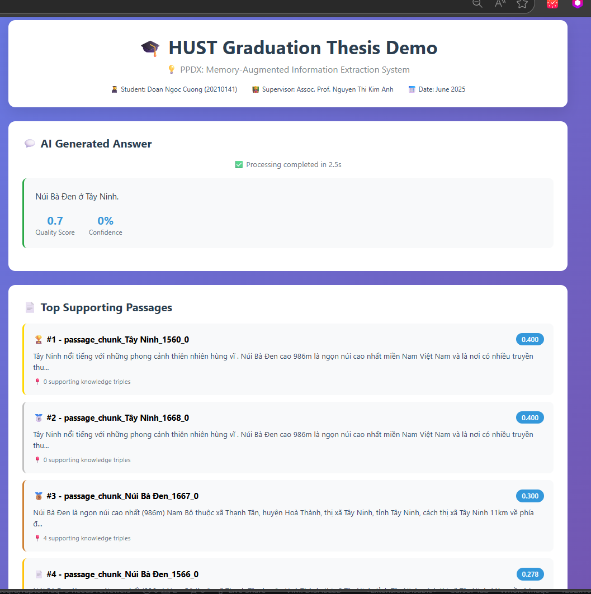
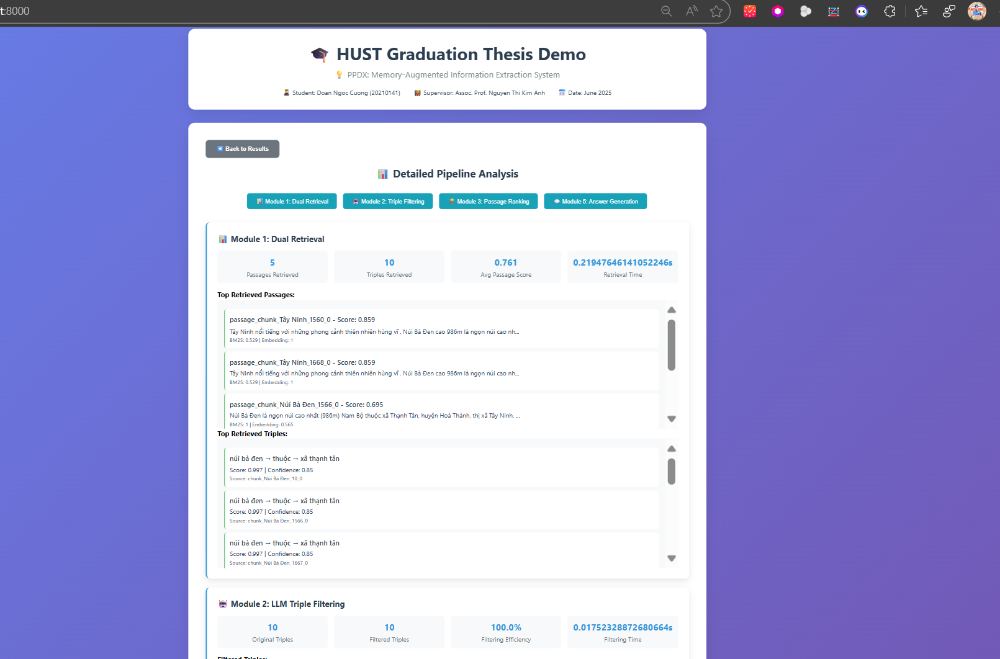

```bash
OnlineRetrievalAndQA/
├── (existing files...)
└── web_demo/
    ├── app.py          # FastAPI server
    ├── index.html      # UI  
    ├── requirements.txt
    └── run.sh

```


---

```bash
system/
├── 📖 README.md
├── 📋 requirements.txt  
├── 🌍 .env.example
├── 📁 baselineRAG/
├── 📁 eval/
├── 📁 PPDX/
│   ├── 📁 DB/
│   │   └── 🐳 docker-compose.yml
│   │
│   └── 📁 offline_indexing/
│       ├── 📋 offline_indexing_requirements.txt
│       │
│       ├── 📄 module1_chunking.py
│       ├── 🧠 module2_triple_extractor.py  
│       ├── 🔗 module3_synonym_detector.py
│       ├── 🏗️ module4_graph_builder.py
│       ├── 🎯 pipeline_orchestrator.py
│       │
│       ├── 📁 utils/
│       │   ├── 🔧 utils_general.py
│       │   ├── 📊 utils_excel_documents.py
│       │   └── 🗃️ utils_neo4j.py
│       │
│       └── 📁 test/
│           ├── 📊 test_data.py
│           ├── 🚀 run_offline_pipeline.py
│           ├── 🧪 test_offline_pipeline.py
│           └── 🔍 test_query_functions.py
        │📁 OnlineRetrievalAndQA/                      # 🌐 ONLINE PHASE
        ├── 📋 online_requirements.txt                # Dependencies for online phase
        │
        ├── 🔍 module1_dual_retrieval.py              # Bước 1: Dual/Hybrid Retrieval
        ├── 🤖 module2_triple_filter.py               # Bước 2: LLM Triple Filtering  
        ├── 📊 module3_passage_ranker.py              # Bước 3: Triple-based Passage Ranking
        ├── 🎯 module4_context_expander.py            # Bước 4: 1-hop Context Expansion (Optional)
        ├── 🗣️ module5_answer_generator.py            # Bước 5: Final Answer Generation
        │
        ├── 🎯 (retrieval_pipeline_orchestrator)  online_pipeline_orchestrator.py        # Pipeline Logic Coordinator (Core orchestration)

        ----   retrieval_and_qa_pipeline_orchestrator.py  (file này ko dùng đến - nên đã comment ẩn đi)│

        ├── 🔍 run_retrieval_pipeline.py              # Run Retrieval Only (Steps 1-3/4)
        │                                             # Args: --enable_expansion True/False
        ├── 🌐 run_retrieval_and_qa_pipeline.py       # Run Full Pipeline (Steps 1-5)
        │                                             # Args: --enable_expansion True/False
        │
        ├── 📁 utils/                                 # 🔧 UTILS FLATTENED BY MODULE
        │   ├── 🔧 utils_shared_general.py            # General shared utilities
        │
        └── 📁 test/    # ko cần nữa luôn 
        ├── 📖 README.md
        ├── 📚 docs/
        │   ├── 🚀 quickstart.md
        │   └── 🔧 api_reference.md
        ├── 📁 outputs/
        │   ├── 📁 retrieval_results/
        │   └── 📁 final_answers/
        ├── .env.example

```


Giải pháp UI phức tạp xíu: 
```bash
├── OfflineIndexing
├── OnlineRetrievalAndQA/
└── 📁 frontend
```


Giải pháp UI đơn giản và nhanh

```bash
OnlineRetrievalAndQA/
├── (existing files...)
└── web_demo/
    ├── app.py          # FastAPI server
    ├── index.html      # UI  
    ├── requirements.txt
    └── run.sh

```


## Chi tiết quá trình build Demo tại: 

https://github.com/DoanNgocCuong/ResearchProject_Memory-AugmentedAIAgents_GraduationProject/tree/main/utiils/research/v6_UI_


### Image demo


